<div align="center">



<br/>


</div>

<br/>

## 🤘 About Me

- 👤 **Name:** Czan Dev
- 🎓 **Background:** B.Tech in Computer Science & Engineering — Jain University *(CGPA 8.5)*
- 💼 **Currently:** Technical Lead — Web Development, API Integrations & IT Infrastructure
- 🤖 **Focus:** AI models, AI agents, intelligent automation & full-stack systems
- 📍 **Location:** Kathmandu, Nepal 🇳🇵
- 🗣️ **Languages:** English, Nepali
- ⚡ **Fun fact:** I turn ideas into shipped products — from ML models to Play Store apps

---

## 👨‍💻 What I'm Doing Right Now

```yaml
role: Technical Lead
currently:
  - 🧑‍💻 Managing digital operations, web development, API integrations & IT infrastructure
  - 🤖 Building & fine-tuning AI models and AI agents for automation and decision-making
  - 📱 Shipping production Flutter apps (live on Google Play) + WordPress & Webflow sites
  - ☁️ Exploring cloud-native architecture, CI/CD pipelines & scalable backends
  - 🚀 Open to: Software Developer · AI Engineer · Full-Stack roles · Freelance work
```

---

## 🛠️ What I Do

<table>
<tr>
<td width="50%" valign="top">

### 🤖 AI Engineering
Design, train & fine-tune ML models. Build AI agents and agentic workflows for automation and intelligent decision-making.

### 🌐 Full-Stack Development
End-to-end web apps with modern JS/TypeScript, WordPress, Webflow — plus Flutter for mobile.

</td>
<td width="50%" valign="top">

### ⚙️ Automation & IT Support
Google Workspace automation, domain/DNS/hosting management, uptime monitoring & cybersecurity basics.

### 🔁 DevOps Fundamentals
Git, Docker, CI/CD pipelines, Firebase, GCP, and AWS/Azure essentials.

</td>
</tr>
</table>

---

## 🚀 Featured Projects

<table>
<tr>
<td width="50%" valign="top">

#### 🫀 Heart Disease Prediction (ML)
Built an ML model on the Cleveland Heart Disease dataset with a strong focus on feature engineering and algorithm tuning.

**+15% accuracy** over baseline models

`Python` `scikit-learn` `Machine Learning`

[📄 Read the Research Paper](https://ijircce.com/admin/main/storage/app/pdf/4ljEtLkX8hkOzL59qHMx…)

</td>
<td width="50%" valign="top">

#### 📱 SNS Clocked In — Android App
Workforce management app live on Google Play (`com.snstech.sns_rooster`). GPS clock-in/out, leave requests, real-time tracking & compliance with Australian labor law.

`Flutter` `Firebase` `Google Play`

</td>
</tr>
<tr>
<td width="50%" valign="top">

#### 🌐 Accounting SNS
Official website for a Sydney-based tax, BAS, payroll & SMSF accounting firm.

`WordPress` · [accountingsns.com.au](https://accountingsns.com.au)

</td>
<td width="50%" valign="top">

#### ✈️ CEMT Travel
WordPress site built end-to-end for an Australian travel agency.

`WordPress` · [cemttravel.com.au](https://cemttravel.com.au)

</td>
</tr>
</table>

---

## 🖥️ Tech Stack



<table>
<tr>
<th align="left">Category</th>
<th align="left">Tools</th>
</tr>
<tr>
<td valign="top"><b>Languages</b></td>
<td>

 Python &nbsp;
 Java &nbsp;
 JavaScript &nbsp;
 TypeScript &nbsp;
 Dart &nbsp;
 C++

</td>
</tr>
<tr>
<td valign="top"><b>Mobile & Web</b></td>
<td>

 Flutter &nbsp;
 React &nbsp;
 HTML5 &nbsp;
 CSS3 &nbsp;
 WordPress &nbsp;
 Node.js

</td>
</tr>
<tr>
<td valign="top"><b>Cloud & DevOps</b></td>
<td>

 Firebase &nbsp;
 Docker &nbsp;
 GCP &nbsp;
 AWS &nbsp;
 Azure &nbsp;
 Git

</td>
</tr>
<tr>
<td valign="top"><b>Tools</b></td>
<td>

 GitHub &nbsp;
 Figma &nbsp;
 VS Code &nbsp;
 Linux

</td>
</tr>
</table>

---

## 📊 GitHub Stats

<div align="center">


<br/>


<br/>


<br/>


</div>

<!--
  Want a live animated snake eating your contribution graph? Add this GitHub
  Action (Settings → Actions → New workflow) at .github/workflows/snake.yml:

  name: Generate Snake
  on:
    schedule:
      - cron: "0 0 * * *"
    workflow_dispatch: {}
    push:
      branches: [ main ]
  jobs:
    generate:
      permissions:
        contents: write
      runs-on: ubuntu-latest
      steps:
        - uses: Platane/snk@v3
          with:
            github_user_name: devczan
            outputs: dist/github-contribution-grid-snake.svg
        - uses: crazy-max/ghaction-github-pages@v4
          with:
            target_branch: output
            build_dir: dist
          env:
            GITHUB_TOKEN: ${{ secrets.GITHUB_TOKEN }}

  Then embed it here with:
  
-->

---

## 💬 Let's Connect

I'm actively exploring **Software Developer / AI Engineer / Full-Stack** roles (remote or on-site) and open to freelance work involving AI agents, ML models, web apps, and automation.

<div align="center">

<a href="mailto:dev1czan@gmail.com">
  
</a>
<a href="https://github.com/devczan">
  
</a>
<a href="https://www.linkedin.com/in/czandev/">
  
</a>

<br/><br/>

📞 +977 9861886889 &nbsp;·&nbsp; 📍 Kathmandu, Nepal

</div>

---


